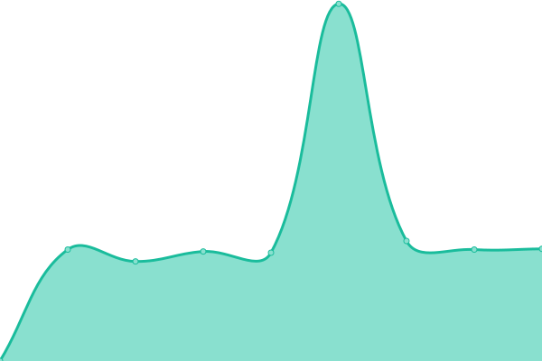
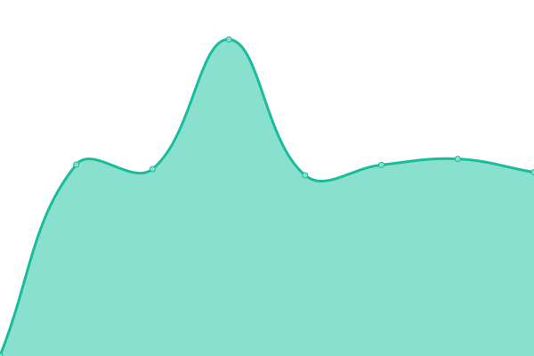
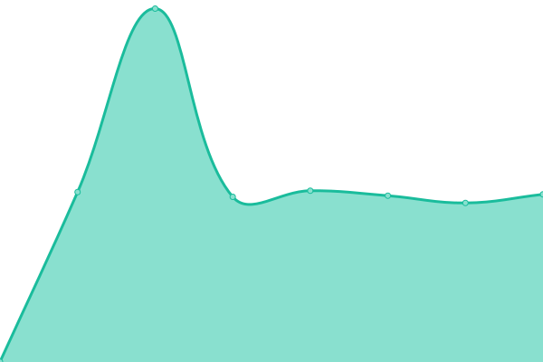
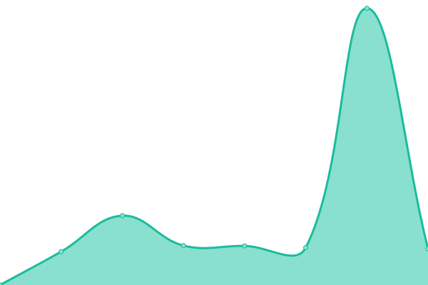

# [📈 Live Status](https://demo.upptime.js.org): <!--live status--> **🟧 Partial outage**

This repository contains the open-source uptime monitor and status page for [DS Media Group](https://project.dsgroupmedia.com), powered by [Upptime](https://github.com/upptime/upptime).

With [Upptime](https://upptime.js.org), you can get your own unlimited and free uptime monitor and status page, powered entirely by a GitHub repository. We use [Issues](https://github.com/dsmgid/status/issues) as incident reports, [Actions](https://github.com/dsmgid/status/actions) as uptime monitors, and [Pages](https://demo.upptime.js.org) for the status page.

<!--start: status pages-->
<!-- This summary is generated by Upptime (https://github.com/upptime/upptime) -->
<!-- Do not edit this manually, your changes will be overwritten -->
<!-- prettier-ignore -->
| URL | Status | History | Response Time | Uptime |
| --- | ------ | ------- | ------------- | ------ |
|  [Website](https://pdmuliasari.co.id) | 🟩 Up | [website.yml](https://github.com/dsmgid/pdml-status/commits/HEAD/history/website.yml) | 

 1294ms
     
 | 

<a href="https://status.pdmuliasari.co.id/history/website">100.00%</a>
    

|  API | 🟥 Down | [api.yml](https://github.com/dsmgid/pdml-status/commits/HEAD/history/api.yml) | 

 906ms
     
 | 

<a href="https://status.pdmuliasari.co.id/history/api">100.00%</a>
    

|  API V2 | 🟥 Down | [api-v2.yml](https://github.com/dsmgid/pdml-status/commits/HEAD/history/api-v2.yml) | 

 805ms
     
 | 

<a href="https://status.pdmuliasari.co.id/history/api-v2">100.00%</a>
    

|  [POS](https://pos.pdmuliasari.co.id) | 🟥 Down | [pos.yml](https://github.com/dsmgid/pdml-status/commits/HEAD/history/pos.yml) | 

 820ms
     
 | 

<a href="https://status.pdmuliasari.co.id/history/pos">100.00%</a>
    

|  [Order System](https://order.pdmuliasari.co.id) | 🟩 Up | [order-system.yml](https://github.com/dsmgid/pdml-status/commits/HEAD/history/order-system.yml) | 

 1142ms
     
 | 

<a href="https://status.pdmuliasari.co.id/history/order-system">100.00%</a>
    

<!--end: status pages-->

[**Visit our status website →**](https://demo.upptime.js.org)

## 📄 License

- Code: [MIT](./LICENSE) © [DS Media Group](https://project.dsgroupmedia.com)
- Data in the `./history` directory: [Open Database License](https://opendatacommons.org/licenses/odbl/1-0/)
